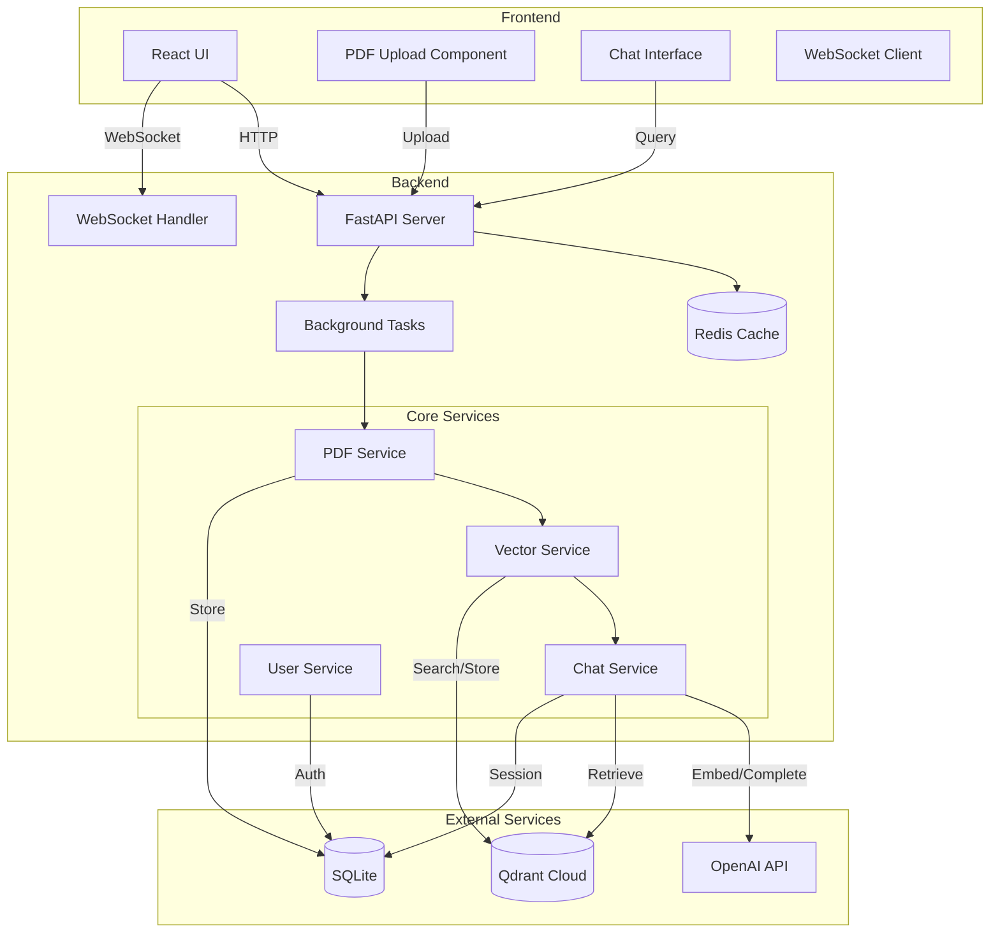
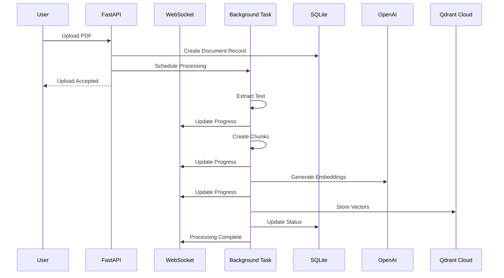
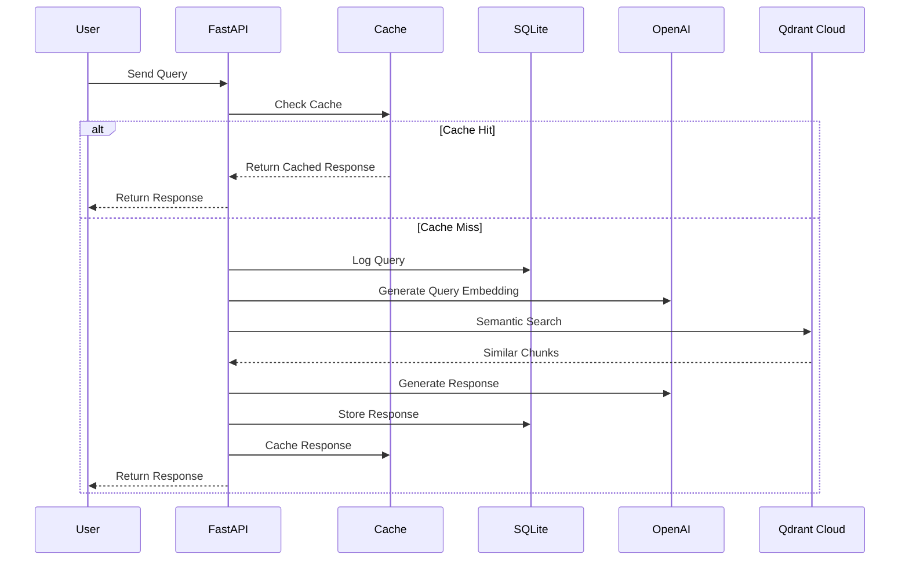
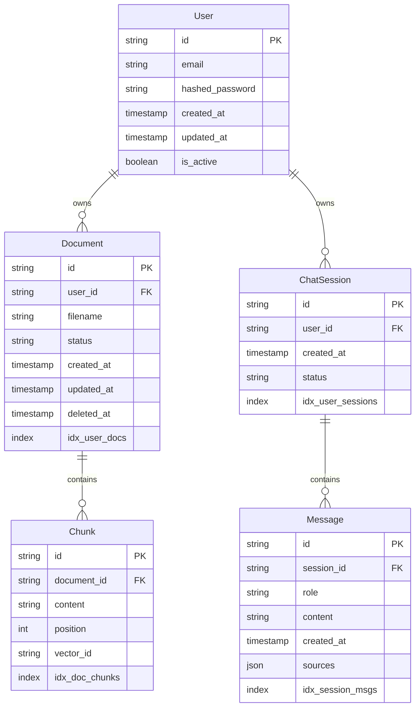

# Advanced RAG Application Architecture

## System Overview

This document outlines the simplified, async-first architecture for our RAG application using FastAPI, React, and Qdrant Cloud.

## Component Architecture

## Sequence Diagrams

### PDF Upload and Processing Flow

### Chat Query Flow

## Data Model

## Project Structure

```mermaid
graph TD
    subgraph Project Root
        B[backend]
        F[frontend]
        D[docker]
        DOC[docs]
    end
    
    subgraph Backend Structure
        B --> BA[app]
        B --> BT[tests]
        B --> BS[scripts]
        B --> BM[migrations]
        
        BA --> BC[core]
        BA --> BR[api]
        BA --> BSV[services]
        BA --> BMD[models]
        BA --> BU[utils]
        
        BC --> BCC[config.py]
        BC --> BCL[logger.py]
        BC --> BCA[auth.py]
        BC --> BCH[health.py]
        
        BR --> BRD[documents.py]
        BR --> BRC[chat.py]
        BR --> BRU[users.py]
        BR --> BRH[health.py]
        
        BSV --> BSVP[pdf.py]
        BSV --> BSVV[vector.py]
        BSV --> BSVC[chat.py]
        BSV --> BSVU[user.py]
        
        BMD --> BMDB[base.py]
        BMD --> BMDD[document.py]
        BMD --> BMDC[chat.py]
        BMD --> BMDU[user.py]
    end
    
    subgraph Frontend Structure
        F --> FS[src]
        FS --> FC[components]
        FS --> FP[pages]
        FS --> FH[hooks]
        FS --> FU[utils]
        
        FC --> FCC[Chat]
        FC --> FCP[PDFUpload]
        FC --> FCU[UserAuth]
        
        FP --> FPH[Home]
        FP --> FPC[Chat]
        FP --> FPL[Login]
        
        FH --> FHA[useChat]
        FH --> FHU[useUpload]
        FH --> FHW[useWebSocket]
        
        FU --> FUF[fetcher.ts]
        FU --> FUA[auth.ts]
        FU --> FUW[ws.ts]
    end
    
    subgraph Documentation
        DOC --> DA[api]
        DOC --> DE[examples]
        DOC --> DD[deployment]
    end
``` 

